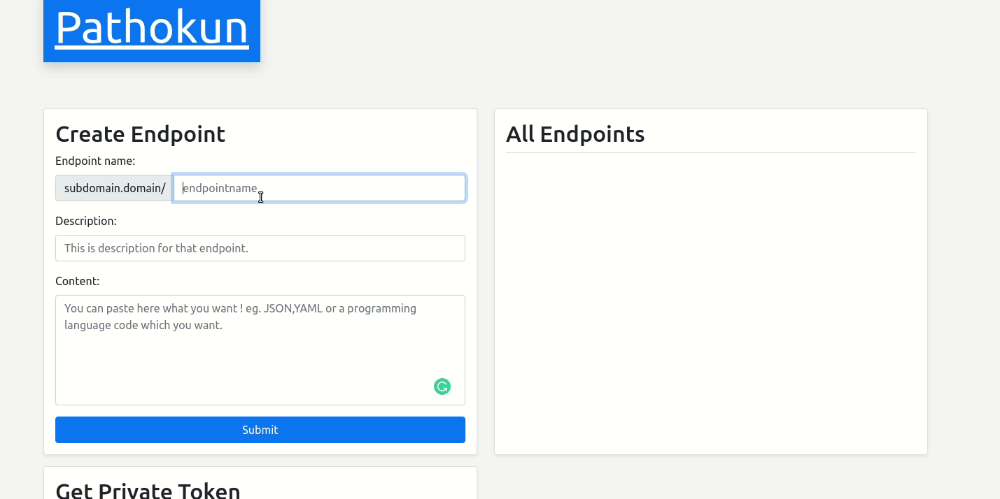
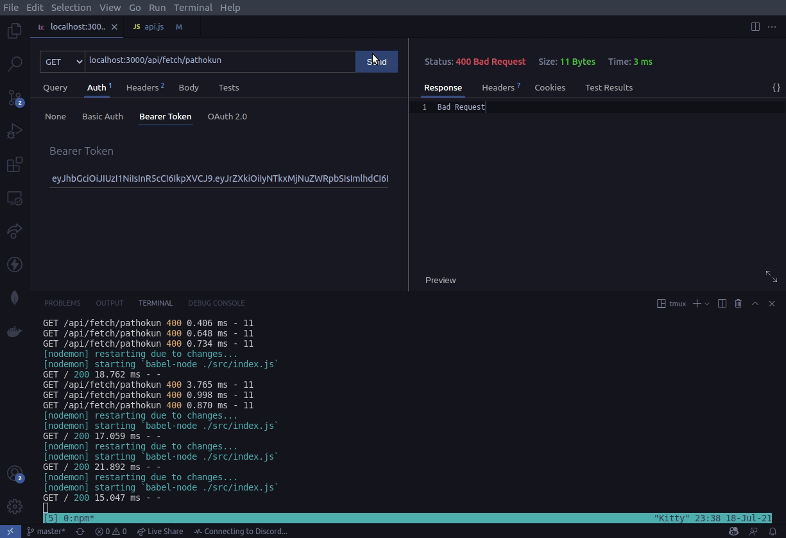

# Pathokun 

Pathokun, a path generater, update your content just with your frontend by HTTP GET Request! In this way you can make Full-Stack project without any backend with any programming language.

## What does the Pathokun solve?
Pathokun removes the taboo that you can't have a Full-Stack project without a backend.


## Workprincpe


### Environment Variables

Firstly you will need to add the following environment variables to your .env file

`JWT_PRIVATE_SECRET` = *Secret key for private token*

### **Add New Path to Account**



According to the Pathokun use purpose, you must first create a endpoint by have in user panel create endpoint form.

eg:


### **Generate Private Token**
Whenever you want fetch your content by pathname, firstly have to generate an private access token from user panel.

eg:


### **Fetch Content from Endpoint**
So after you have generate a private token you can directly access your content by endpoint.Just you have to put your private token
to header with bearer and sending a GET Request.

eg: 


> THIS GENERATED TOKEN IS MUST BE SECRET !!!



### **Database Schema**


| uuid | secret_key | endpoint |
| :--- | :--------- | :------- |
| `string` | `string` | `array` |


### ***endpoint* Schema**

| url | description | content | date
| :--- | :--------- | :------- | :---
| `string` | `string` | `string` | `date`


## Run Locally

Clone the project

```bash
  git clone git@github.com:Pathokun/pathokun.git
```

Go to the project directory

```bash
  cd pathokun
```

Install dependencies

```bash
  npm install
```

Start the server

```bash
  npm run dev
```

## Docker Image

Build Dockerfile

```bash
  docker build . -t pathokun
```

Run Docker Image
```bash
  docker run <CONTAINER_ID>
```

## Contributing
Pull requests are welcome. For major changes, please open an issue first to discuss what you would like to change.

## Show your support

Give a ⭐️ if this project helped you! or buy me a 🍺
<a href="https://www.paypal.com/paypalme/nedimakar5341">Paypal</a>

## License
[MIT](https://choosealicense.com/licenses/MIT/)
  